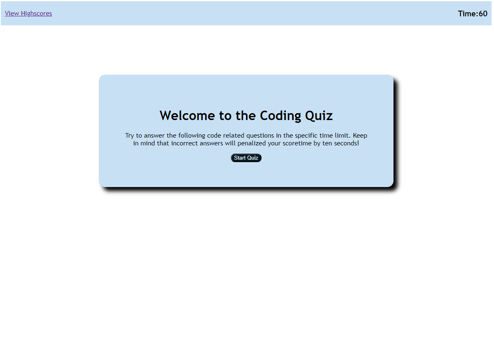

#Coding Quiz

## Your Task

This assignment focused on creating a timed quiz. For the first time we are integrating Javascript into our web development skills. This quiz includes 4 questions on material I have learned in bootcamp. Scoring is defined on how much time is left when the last question has been answered. Each wrong answer deducts 10 seconds. Rankings for the top 5 scores are stored on the High Scores page. 

## User Story

```
AS A coding boot camp student
I WANT to take a timed quiz on JavaScript fundamentals that stores high scores
SO THAT I can gauge my progress compared to my peers
```


## Acceptance Criteria

```
GIVEN I am taking a code quiz
WHEN I click the start button
THEN a timer starts and I am presented with a question
WHEN I answer a question
THEN I am presented with another question
WHEN I answer a question incorrectly
THEN time is subtracted from the clock
WHEN all questions are answered or the timer reaches 0
THEN the game is over
WHEN the game is over
THEN I can save my initials and my score
```

## Links to Repo and Quiz Deployed

Quiz Demo: https://domspadafora.github.io/Coding-Quiz/

Repo: https://github.com/DomSpadafora/Coding-Quiz.git


© 2022 edX Boot Camps LLC. Confidential and Proprietary. All Rights Reserved.